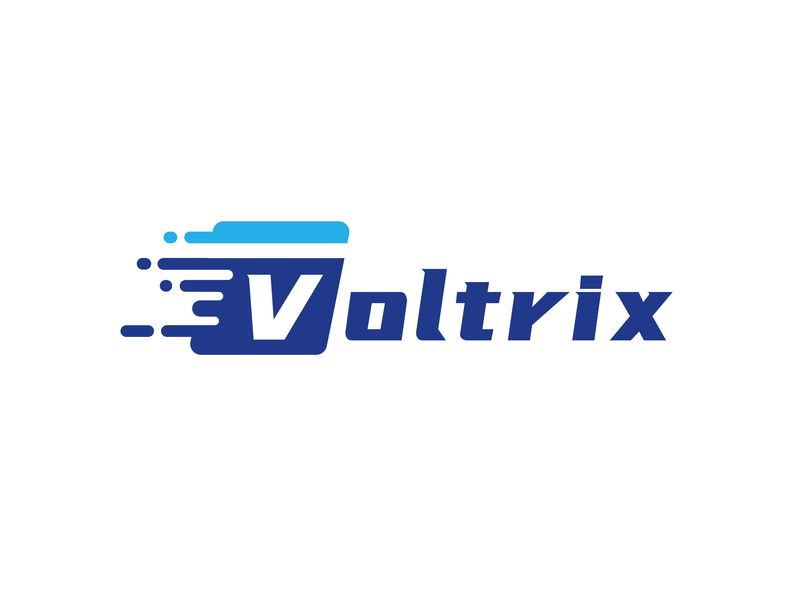

# Voltrix-SpMM 
<p align="center">
  
</p>

**Artifact Evaluation for the paper** : *"Revitalizing Sparse Matrix-Matrix Multiplication on Tensor Cores with Asynchronous and Balanced Kernel Optimization"*

Welcome to Voltrix-SpMM! This is a high-performance sparse matrix-matrix multiplication (SpMM) library specifically optimized for the NVIDIA Hopper architecture. It leverages advanced GPU features of modern hardware, such as the Tensor Memory Accelerator (`TMA`) and `mbarrier`, to achieve state-of-the-art performance.

---


## ⚙️ Requirements 


### Hardware 

 
- **GPU Architecture:**  NVIDIA Hopper or newer (compute capability **SM ≥ 90** ).

Voltrix **requires NVIDIA Hopper-specific architectural features** , including **Tensor Memory Accelerator (TMA)**  for high-throughput memory movement and **mbarrier**  for efficient thread synchronization. 


### Software 

 
- **CUDA Toolkit:**  ≥ **12.1**
 
- **NVCC Compiler:**  ≥ **12.3**
 
- **Python:**  ≥ **3.12**
 
- **PyTorch:**  ≥ **2.1**  (with Hopper support)


---


## 📦 Clone the Repository 


```bash
git clone git@github.com:YaqiXia/Voltrix-SpMM.git
cd Voltrix-SpMM
```


---


## 🧰 Environment Setup 

We recommend using `conda` for environment management.

### Step 1: Create and activate the environment 


```bash
conda create -n voltrix python=3.12
conda activate voltrix
```


### Step 2: Install dependencies 

We recommend installing PyTorch via conda to ensure compatibility with your CUDA version:

```bash
# Recommended: Install PyTorch via conda (ensure compatibility with your CUDA 12.1+)
conda install pytorch torchvision torchaudio pytorch-cuda=12.1 -c pytorch -c nvidia

# Alternatively, if you prefer pip and have ensured your CUDA environment is correctly configured:
# pip install torch torchvision torchaudio --index-url https://download.pytorch.org/whl/cu121

# Install other dependencies
pip install scipy
```


### Step 3: Install Voltrix-SpMM in editable mode 


```bash
pip install -e .
```
This allows your modifications to the source code to take effect immediately without reinstalling.

### Step 4: Test JIT compilation 


```bash
python tests/test_jit.py
```


Expected output:


```bash
JIT test passed
```


This indicates that the JIT compilation feature is successfully configured and working.


---


## 🔧 Environment Variables Configuration

Voltrix-SpMM exposes several environment variables to support **debugging** , **performance tuning** , and **custom compilation workflows** . These variables are defined in [project/const.py](https://chatgpt.com/c/project/const.py)  and can be configured at runtime.

### Key Environment Variables 

| Variable | Description | 
| --- | --- | 
| VOLTRIX_JIT_DEBUG | Enables verbose debug output during JIT compilation. | 
| VOLTRIX_NVCC_COMPILER | Specifies the absolute path to a custom nvcc compiler binary. | 
| VOLTRIX_CACHE_DIR | Sets the directory for caching compiled binaries (default: ~/.voltrix-spmm/). | 
| VOLTRIX_PTXAS_VERBOSE | Enables verbose output from the ptxas compiler backend. | 
| VOLTRIX_JIT_PRINT_NVCC_COMMAND | Prints the full nvcc command used for JIT compilation. | 
| VOLTRIX_PRINT_AUTO_TUNE | Prints detailed logs during kernel auto-tuning. | 


### Example: Setting Variables in Shell 


You can configure these variables by exporting them in your shell session:


```bash
export VOLTRIX_JIT_DEBUG=1
export VOLTRIX_NVCC_COMPILER=/usr/local/cuda/bin/nvcc
export VOLTRIX_CACHE_DIR=~/.voltrix-spmm/
export VOLTRIX_PTXAS_VERBOSE=1
export VOLTRIX_JIT_PRINT_NVCC_COMMAND=1
export VOLTRIX_PRINT_AUTO_TUNE=1
```


---


## 🧪 Run SpMM Test 

Execute the following command to run a basic SpMM functionality test:

```bash
python tests/test_spmm.py
```


Example output:


```yaml
difference rate: 0.00%
voltrix time: 2.23 ms
cusparse time: 3.45 ms
```


This output confirms that the core functionality of Voltrix-SpMM is working correctly and shows a comparison with cuSPARSE results.


---


## 🚀 Benchmark Reproduction Results from the Paper 


Follow these steps to reproduce the benchmark results presented in the paper:


### Step 0: Set Voltrix project path 


```bash
export VOLTRIX_PATH=$(pwd)
```


### Step 1: Build Third-Party Libraries 


#### 1.1 Initialize Git Submodules


```bash
git submodule update --init --recursive
```


#### 1.2 Build TCGNN-PyTorch 


```bash
cd $VOLTRIX_PATH/third-party/TC-GNN/TCGNN_conv
TORCH_CUDA_ARCH_LIST="9.0a;9.0" python setup.py install # Hopper architecture
```


#### 1.3 Build DTC-SpMM 


```bash
cd $VOLTRIX_PATH/third-party/
bash ./build_dtc.sh
```


#### 1.4 Build RoDe 


```bash
cd $VOLTRIX_PATH/third-party/RoDe
# Apply necessary patches
git apply ../../patches/rode_fix.patch

mkdir -p build && cd build

# Set GLOG path (a submodule of DTC-SpMM)
GLOG_ROOT_DIR=$VOLTRIX_PATH/third-party/DTC-SpMM/third_party/glog

cmake .. \
  -DCMAKE_CUDA_FLAGS="--use_fast_math -Xcompiler=-fopenmp -gencode arch=compute_90,code=sm_90 -Xcompiler=-I/usr/include,-I/usr/include/x86_64-linux-gnu" \
  -DCMAKE_CUDA_ARCHITECTURES="90" \
  -DGLOG_INCLUDE_DIR=$GLOG_ROOT_DIR/build/include \
  -DGLOG_LIBRARY=$GLOG_ROOT_DIR/build/lib/libglog.so
make -j $(nproc) # Use all available cores for parallel compilation
```


---


### Step 2: Build Benchmark Scripts 


```bash
cd $VOLTRIX_PATH/bench/scripts
bash build.sh
```


---


### Step 3: Download Benchmark Datasets 


```bash
cd $VOLTRIX_PATH
wget https://drive.google.com/file/d/1MuMsRr_Swi66isVHZYNkCWTnPblROT2g/view?usp=sharing
unzip datasets.zip
rm datasets.zip
```
**Note**: Direct download links for Google Drive can sometimes change or require confirmation. If the `wget` command above fails, you may need to manually download `datasets.zip` from `https://drive.google.com/file/d/1MuMsRr_Swi66isVHZYNkCWTnPblROT2g/view?usp=sharing` into the `$VOLTRIX_PATH` directory and then unzip it.


---


### Step 4: Configure Benchmark Environment Variables 


```bash
export TCGNN_PATH=$VOLTRIX_PATH/third-party/TC-GNN
export DATASET_PATH=$VOLTRIX_PATH/datasets
export RODE_HOME=$VOLTRIX_PATH/third-party/RoDe
export LD_LIBRARY_PATH=$VOLTRIX_PATH/third-party/DTC-SpMM/third_party/sputnik/build/sputnik:$LD_LIBRARY_PATH
export LD_LIBRARY_PATH=$VOLTRIX_PATH/third-party/DTC-SpMM/third_party/glog/build:$LD_LIBRARY_PATH
```


---


### Step 5: Run the Benchmark 


```bash
cd $VOLTRIX_PATH/bench
python bench_all.py
```


This will run all benchmarks and compare Voltrix-SpMM against baseline methods. Results are typically output to the console and a specified csv file.


---


## 📄 License 

This project is released under the **MIT License** .
